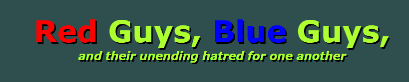
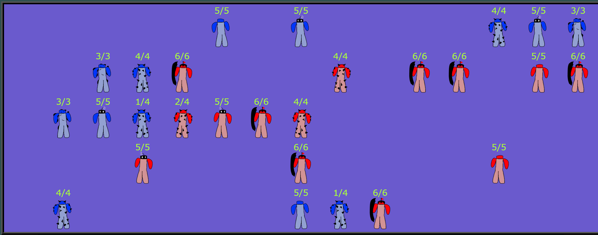
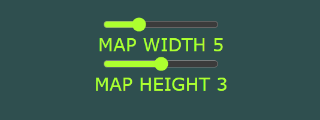
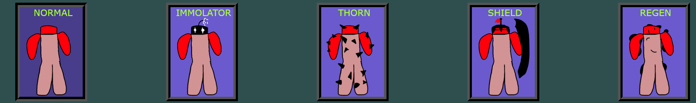
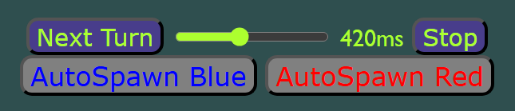

# 

**A simple turn-based game featuring red guys vs blue guys.**

## Features:
### Adjustable map settings

Control the height and width of the map.
### Five unique units

1. Normal, the basic guy.
2. Immolator, damages self to deal more damage.
3. Thorn, deals damage when taking damage.
4. Shield, reduces damage taken from an opponent.
5. Regen, heals one health per turn.
### Auto-play

Want to just watch? Enable AutoSpawn for both sides and set the turn timer